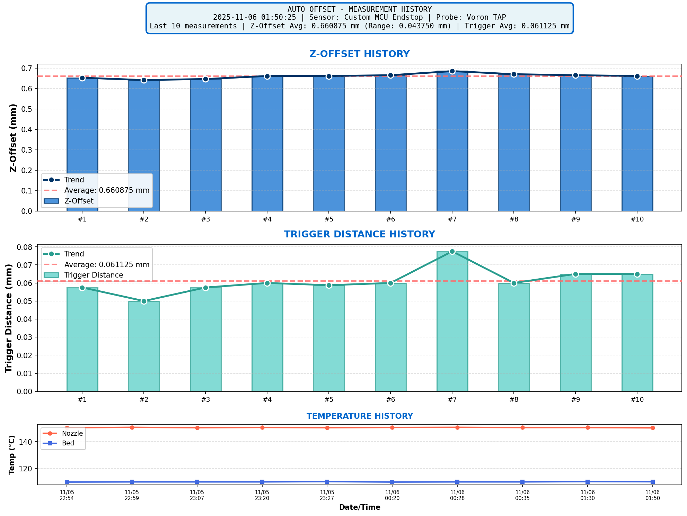
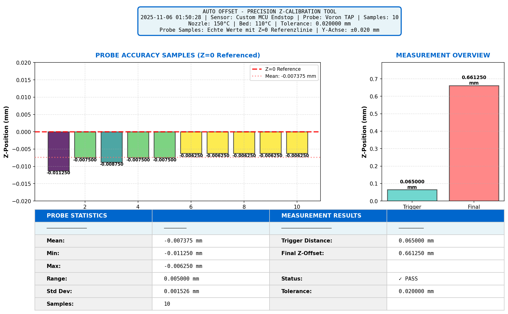

 # 🎯 Klipper Auto Z-Offset für TAB

Automatische Z-Offset Messung für Klipper

## ✨ Features

- 🚀 **schnelle Messungen**
- 🎯 **Hochpräzise** (±0.0075mm mit 6 Nachkommastellen)
- 📊 **Delta-Offset System** - Korrekte Berechnung bei mehrfachen Messungen
- 📈 **Plots** - History & Current Plots
- 🔧 **3 Debug-Level** (0=Clean, 1=Details, 2=Maximum)
- ⚡ **Optimierte 2. Messung** - Nutzt gespeicherte Werte

---

## 📈 Plots & Visualisierung

Das Modul erstellt automatisch **professionelle Plots** deiner Z-Offset Messung:

### 📊 History Plot
Zeigt alle bisherigen Messungen über die Zeit - perfekt um Trends zu erkennen:



### 🎯 Current Plot  
Zeigt detaillierte Statistiken der aktuellen Messung:



**Plot Features:**
- 📊 Automatische CSV-Speicherung aller Messungen
- 📈 Trend-Erkennung über Zeit (History)
- 📁 Speicherort: `~/printer_data/config/Auto_Offset/Auswertung/`
- 🖼️ PNG-Export für Mainsail/Fluidd Ansicht

---

## 🚀 Installation

### **Methode 1: One-Liner (schnell)** ⚡

```bash
curl -sSL https://raw.githubusercontent.com/Printfail/Auto_Offset_Tab/main/install.sh | bash
```

### **Methode 2: Manuell (empfohlen)** 📦

```bash
cd ~
git clone https://github.com/Printfail/Auto_Offset_Tab.git
cd Auto_Offset_Tab
chmod +x install.sh  # Execute-Rechte setzen
./install.sh
```

**Das Menü bietet folgende Optionen:**

| Option            | Beschreibung                                                           |
| ----------------- | ---------------------------------------------------------------------- |
| **1️⃣ Install**   | Installiert Auto Offset zum ersten Mal (Python-Modul + Config-Dateien) |
| **2️⃣ Update**    | Aktualisiert das Python-Modul (via `git pull`)                         |
| **3️⃣ Uninstall** | Entfernt Auto Offset komplett (optional inkl. Config)                  |
| **4️⃣ Status**    | Zeigt Installationsstatus (Python-Modul, Config, Klipper)              |
| **5️⃣ Exit**      | Beendet das Menü                                                       |

> 💡 **Tipp:** Methode 1 installiert automatisch ohne Menüinteraktion.

```
## 🔄 Auto-Updates (optional)

Für automatische Update-Benachrichtigungen in Mainsail/Fluidd:

### **Moonraker Update Manager aktivieren**

Füge in `~/printer_data/config/moonraker.conf` ein:

```ini
[update_manager auto_offset]
type: git_repo
channel: dev
path: ~/Auto_Offset_Tab
origin: https://github.com/Printfail/Auto_Offset_Tab.git
managed_services: klipper
primary_branch: main
install_script: install.sh
```

Danach Moonraker neu starten:

```bash
sudo systemctl restart moonraker
```

✅ **Fertig!** Updates erscheinen jetzt automatisch in der Web-UI!

**Wie es funktioniert:**
- Moonraker prüft regelmäßig auf neue GitHub-Commits
- Bei Updates erscheint ein **Update-Button** in Mainsail/Fluidd
- 1-Klick Installation: `git pull` + `install.sh` + `klipper restart`

---

### **printer.cfg anpassen**

```ini
# Füge hinzu:
[include Auto_Offset/*.cfg]

# Falls noch nicht vorhanden:
[save_variables]
filename: ~/printer_data/config/variables.cfg
```

---

### **Anpassen & Starten**

Bearbeite `~/printer_data/config/Auto_Offset/Auto_Offset_Variables.cfg`:

* `measure_x` / `measure_y` → Position des **Messplatzes** (die Koordinaten des zweiten Sensors)
* `measure_z_lift` → Sicherheits-Hubhöhe vor der Messung
* `sensor_pin` → Pin von deinem zweiten Sensor (Messplatz)
* `led_name`, `clean_macro` → optional für LED-Signalisierung oder automatisches Düsenreinigen

> 💡 **Hinweis:**
> Der **Messplatz** ist die physische Position auf deinem Druckbett, an der der zweite Sensor die Messung durchführt.
> Diese Koordinaten müssen exakt zu deinem Aufbau passen – idealerweise ein sauberer, plan geschliffener Bereich oder ein kleines Messpad.
> Ein falsch definierter Messplatz kann fehlerhafte Z-Offsets oder Sensorausfälle verursachen.
> Der Messplatz sollte eine glatte, ebene und leitfähige Fläche sein, die direkt mit dem definierten Sensor-Pin verbunden ist.
> Die Düse (Nozzle) dient dabei als zweiter Kontakt und wird mit GND (Masse) verbunden.
> Beim Kontakt zwischen Düse und Messfläche schließt sich der Stromkreis, wodurch der Sensor den Auslösepunkt exakt erkennt.

```gcode
RESTART
AUTO_OFFSET_START
```
---

### **Sensor-Konfiguration**

In Phase 3 der Messung (**SENSOR_OFFSET**) wird der zweite Sensor abgefragt, um den tatsächlichen Z-Versatz zwischen TAP und Zusatzsensor zu bestimmen.
Nur **eine** der folgenden Optionen darf aktiv sein:

| Option                         | Beschreibung                                                                                                                                                | Beispiel                                   |
| ------------------------------ | ----------------------------------------------------------------------------------------------------------------------------------------------------------- | ------------------------------------------ |
| **1️⃣ Eigener Sensor-Pin**     | Direkte Verbindung zu einem physischen Eingangspin am Controllerboard. Verwende dies, wenn du einen separaten Kontaktblock oder Messsensor verdrahtet hast. | `sensor_pin: ^!PG14`                       |
| **2️⃣ Bestehender Sensorpfad** | Nutzt bereits definierte Sensoren aus Klipper, z. B. von der MMU oder vom Toolhead.                                                                         | `sensor_offset_path: mmu.sensors.toolhead` |

> ⚠️ **Wichtig:**
> – Nur **eine Option aktivieren**, die andere mit `#` auskommentieren.
> – `!` bedeutet invertiertes Signal (TRIGGERED = 1, OPEN = 0).
> – Prüfe die Polarität deines Sensors, sonst kann die Messung fehlschlagen.
> – Wenn du den Pfad aus Klipper nutzt, muss der Sensor im System bereits existieren (z. B. unter `[mmu.sensors.toolhead]`).

Beispiel:

```ini
# ═══════════════════════════════════════════════════════════════════
# PHASE 3: SENSOR-OFFSET-MESSUNG (SENSOR_OFFSET)
# ═══════════════════════════════════════════════════════════════════
# Sensor-Auswahl (nur EINE Option aktiv lassen!)

# OPTION 1: Eigener Sensor-Pin 
sensor_pin: ^!PG14

# OPTION 2: Existierender Sensor (z. B. von MMU)
#sensor_offset_path: mmu.sensors.toolhead
```
---

## 📖 Verwendung

```gcode
# Standard
AUTO_OFFSET_START

# Mit eigenen Temperaturen
AUTO_OFFSET_START NOZZLE_TEMP=200 BED_TEMP=60

# Schnell (kalt)
AUTO_OFFSET_START HEAT=0 QGL=0 CLEAN=0

# Debug
AUTO_OFFSET_START DEBUG=2
```

**Verfügbare Parameter:** `HEAT`, `NOZZLE_TEMP`, `BED_TEMP`, `QGL`, `CLEAN`, `ACCURACY_CHECK`, `TRIGGER_DISTANCE`, `OFFSET_MEASURE`, `DEBUG`

### 🎯 Delta-Offset System

**Warum wichtig?** Bei mehrfachen Messungen (z.B. nach Düsenwechsel, Wartung) würde ein normales Makro den alten Offset einfach überschreiben und könnte zu falschen Werten führen.

**Meine Lösung:** Das Modul berechnet **Delta-Offsets** - es erkennt was sich geändert hat und wendet nur die Differenz an:
- **1. Messung:** Neuer Offset wird komplett gespeichert
- **2.+ Messung:** Nur die **Differenz** zum vorherigen Offset wird angewendet
- **Kein doppeltes Zählen!** Alter Offset wird automatisch berücksichtigt

**Beispiel:**
```
1. Messung: -0.6675 mm → SAVE_CONFIG
2. Messung: -0.6500 mm → Delta: +0.0175 mm
   → SET_GCODE_OFFSET Z=-0.0175 mm (Runtime)
   → Korrekt! Kein doppeltes Addieren!
```

### 🔍 Debug Levels

| Level | Zielgruppe | Ausgabe | Befehl |
|-------|-----------|---------|--------|
| **0** | Normale User | Nur wichtigste Infos (Schaltabstand, Z-Offset, Delta) | `AUTO_OFFSET_START DEBUG=0` |
| **1** | Troubleshooting | + Delta-Berechnung, Offset-Vergleich, Kategorien | `AUTO_OFFSET_START DEBUG=1` |
| **2** | Entwickler | + MCU States, Bewegungen, Sensor-Queries, alle Details | `AUTO_OFFSET_START DEBUG=2` |

---

## 📈 Plots

Automatisch erstellte Plots:

**Current Plot:**
- Probe Accuracy Samples (gezoomt)
- Measurement Overview (2 Balken: Trigger Distance, Z-Offset)
- Statistics Table

**History Plot:**
- Z-Offset über Zeit
- Trigger Distance über Zeit
- Temperaturen (Nozzle/Bed)

Plots werden gespeichert in: `~/printer_data/config/Auto_Offset/Auswertung/`

---

## ⚙️ How It Works

### 📋 Messprozess

| Schritt | Aktion | Beschreibung |
|---------|--------|-------------|
| 1️⃣ | **Homing** | Sicherer Ausgangspunkt |
| 2️⃣ | **Heizen** (optional) | Thermische Stabilität |
| 3️⃣ | **QGL** (optional) | Ebenes Bett |
| 4️⃣ | **Reinigung** (optional) | Saubere Düse |
| 5️⃣ | **Probe Accuracy** | Qualitätssicherung (5 Samples) |
| 6️⃣ | **Trigger Distance** | TAP Schaltabstand (1.25µm Präzision) |
| 7️⃣ | **Sensor Offset** | Custom Sensor (10µm Präzision) |
| 8️⃣ | **Delta-Berechnung** | `delta = neu - alt` → Vorzeichen umkehren |
| 9️⃣ | **SET_GCODE_OFFSET** | Runtime-Anpassung |
| 🔟 | **SAVE_CONFIG** | Dauerhaftes Speichern |

### 💡 Intelligente Features

- ⚡ **Gespeicherte Startposition** - 2. Messung fährt direkt zur letzten Position
- 🎯 **Delta-Offset** - Verhindert doppeltes Zählen bei mehrfachen Messungen
- 📊 **6 Nachkommastellen** - Höhere Präzision für Analysen

---

## 🔍 Fehlersuche

### Häufige Fehler

**"Unknown command AUTO_OFFSET_START"**
- → Prüfe ob `auto_offset.py` in `~/klipper/klippy/extras/` liegt
- → Führe `FIRMWARE_RESTART` aus

**"Could not load saved variables"**
- → Füge `[save_variables]` in `printer.cfg` hinzu
- → Prüfe Pfad: `filename: ~/printer_data/config/variables.cfg`

**Debug:** Nutze `AUTO_OFFSET_START DEBUG=2` für maximale Details

---

## 💬 Support

- [GitHub Issues](https://github.com/Printfail/Auto_Offset_Tab/issues)
- [GitHub Discussions](https://github.com/Printfail/Auto_Offset_Tab/discussions)

---

## 📄 Lizenz

GNU GPLv3 - siehe [LICENSE](LICENSE)

---

Made with ❤️ for the Klipper Community
